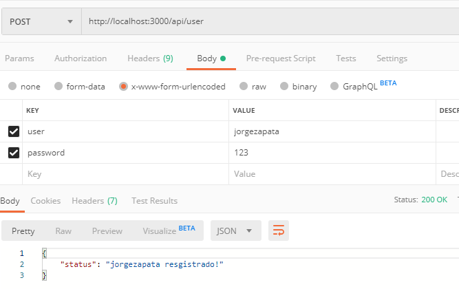
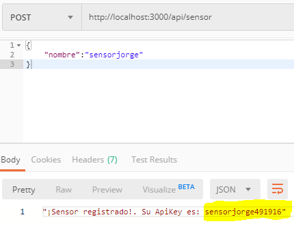
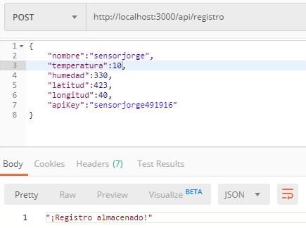
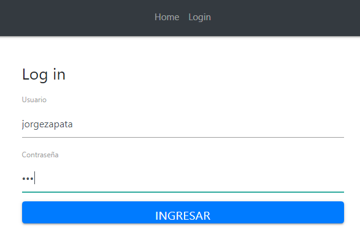
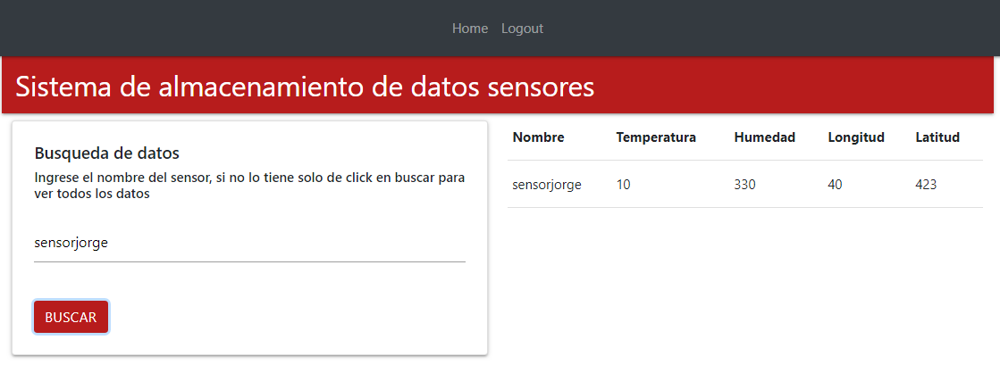

# Descripción
Lo que se realizó en este proyecto fue basicamente una aplicación web bajo un stack MERN. El fin principal de está aplicación es poder registrar datos en la BD correspondientes a datos de sensores como: humedad, temperatura, localización. Además, tambien se pueden visualizar los datos recolectados en la base de datos de dos formas:
  - Ingresando un nombre del sensor especifico, se podrá ver los registros asociados especificamente a ese sensor.
  - Sin nombre del sensor, se podrá ver todos los registros de la base de datos.
De igual forma se puede realizar registro de usuarios, sensores y registros de cada uno de los sensores por medio de POST MAN.

# Tecnologías usadas
Para la realización de este proyecto se usaron las siguientes tecnologías:
* [Mongo] - Base de datos no relacional
* [node.js] - Entorno de ejecución de js
* [express] - Framework de Nodejs para construir Back end
* [React] - Biblioteca de js para construir interfaces de usuario

# Instalación
Se recomienda [Node.js](https://nodejs.org/) v4+ para correr.
Después de clonar el repositorio, en su terminal realice los siguientes comandos:
```sh
//Para la ejecucuón del Back-End
$ cd Proyecto1-TopicosTelematica
$ cd Back
$ npm install 
$ npm run dev 
```
En  otra consola debemos ejecutar el FRONT-END
```sh
$cd Proyecto1-TopicosTelematica
$ cd Front
$ npm install 
$ npm start
```
# Funcionamiento
Por medio de el programa PostMan realizamos la inserción de usuarios, sensores, y registros. Para el caso de los sensores la inserción del dato retorna una API KEY que servirá de verificación en el momento del ingreso de datos. A continuación se puede ver un ejemplo de cada uno.

### Registro de usuario



### Registro de sensor



### Registro de datos del sensor



Para la visualización de los datos ingresamos a http://localhost:3000/ e ingresamos con nuestro usuario y contraseña, siguiendo con el ejemplo anterior veamos:

### Login de usuario



Una vez dentro de la sesión de un usuario podemos visualizar los datos de los sensores que se quiera:

### Visualización



**Free Software, Hell Yeah!**

[//]: # (These are reference links used in the body of this note and get stripped out when the markdown processor does its job. There is no need to format nicely because it shouldn't be seen. Thanks SO - http://stackoverflow.com/questions/4823468/store-comments-in-markdown-syntax)
   [dill]: <https://github.com/joemccann/dillinger>
   [john gruber]: <http://daringfireball.net>
   [df1]: <http://daringfireball.net/projects/markdown/>
   [markdown-it]: <https://github.com/markdown-it/markdown-it>
   [node.js]: <http://nodejs.org>
   [jQuery]: <http://jquery.com>
   [express]: <http://expressjs.com>
[Mongo]: <https://www.mongodb.com/es>
[React]: <https://es.reactjs.org/>
  

