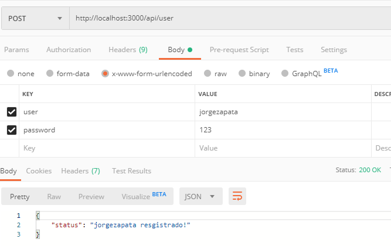
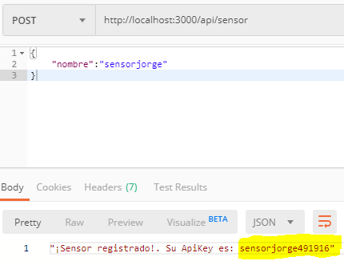
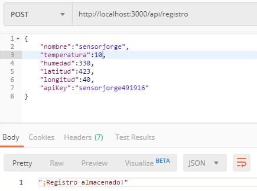
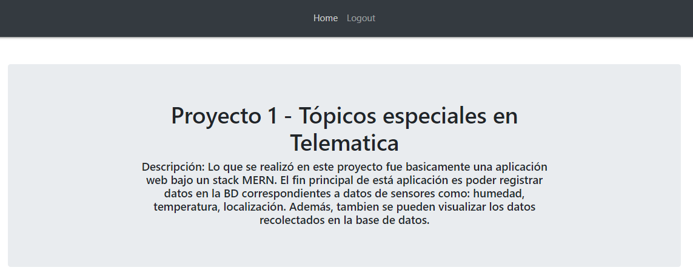
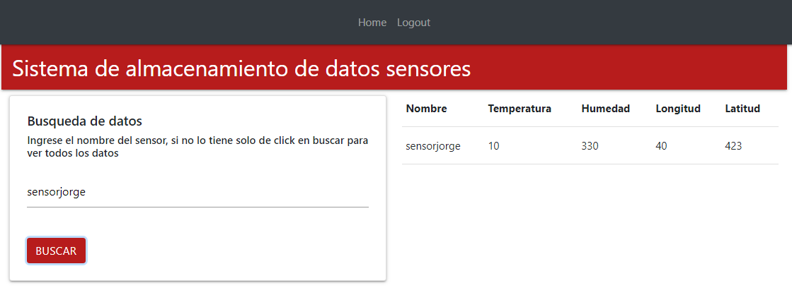
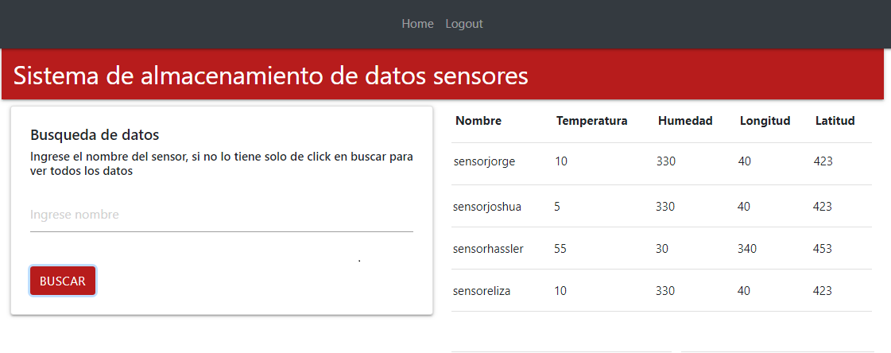

# Problemática
La problemática que se está abordando en este proyecto es la carencia de un sistema de centralización, almacenamiento y visualización de datos que son enviados por medio de sensores. El enfoque de la problemática radica básicamente en la necesidad de tener un sistema que sea capaz de almacenar las peticiones con la información ( humedad, temperatura, latitud, longitud)  de los sensores de forma segura y que permitieran posterior al almacenamiento una visualización de datos.

# Requisitos funcionales
* El sistema tendrá un inicio de sesión para los usuarios de la aplicación 
* El sistema contará con un registro de usuarios, sensores y datos, dichas peticiones se deberán realizar por medio de la herramientas POST-MAN.
* El sistema entregará una ApiKey al usuario a la hora de registrar un sensor, está ApiKey debe ser creada por el mismo sistema para garantizar seguridad en el sistema.
* El sistema tendrá un módulo de visualización de datos.
* El sistema le dará la opción al usuario para que filtre los datos por el nombre de los sensores o dejarlo ver todos los datos de los sensores.
# Requisitos no funcionales
* El sistema tendrá un manejo de encriptación de los datos cuando estos viajen del Back-End al Front-End y viceversa.
* El sistema garantizará que el sensor que esté ingresando un dato esté registrado en el sistema.
* El sistema será intuitivo, ya que al resolver un problema sencillo y al tener tan pocas funcionalidades la navegación debe ser sencilla.
* El sistema garantizará que las personas que están viendo los datos estén registrados (Al acceder por url sin logeo no dejará ver los datos).
* El sistema garantizará que la ApiKey que entregue al usuario con el registro del sensor es única.
* El sistema asegurará que en cada inicio de sesión exista un Token único que será la representación de que hay un usuario dentro de la plataforma.
* El sistema responderá a las peticiones de los usuarios en un tiempo menor a 1 segundo.

# Tecnologías usadas
Para la realización de este proyecto se usaron las siguientes tecnologías:
* [Mongo] - Base de datos no relacional
* [node.js] - Entorno de ejecución de js
* [express] - Framework de Nodejs para construir Back end
* [React] - Biblioteca de js para construir interfaces de usuario

# Instalación
Se recomienda [Node.js](https://nodejs.org/) v4+ para correr.
Después de clonar el repositorio, en su terminal realice los siguientes comandos:
```sh
//Para la ejecucuón del Back-End
$ cd Proyecto1-TopicosTelematica
$ cd Back
$ npm install 
$ npm run dev 
```
En  otra consola debemos ejecutar el FRONT-END
```sh
$cd Proyecto1-TopicosTelematica
$ cd Front
$ npm install 
$ npm start
```
# Funcionamiento
Por medio de el programa PostMan realizamos la inserción de usuarios, sensores, y registros. Para el caso de los sensores la inserción del dato retorna una API KEY que servirá de verificación en el momento del ingreso de datos. A continuación se puede ver un ejemplo de cada uno.

### Registro de usuario



### Registro de sensor



### Registro de datos del sensor



### Home

Para la visualización de los datos ingresamos a http://localhost:3001/  



### Login de usuario

Ingresamos con nuestro usuario y contraseña, siguiendo con el ejemplo anterior veamos:


Una vez dentro de la sesión de un usuario podemos visualizar los datos de los sensores que se quiera:

### Visualización

Visualización de un solo dato:


Visualización de todos los datos:

**Free Software, Hell Yeah!**

[//]: # (These are reference links used in the body of this note and get stripped out when the markdown processor does its job. There is no need to format nicely because it shouldn't be seen. Thanks SO - http://stackoverflow.com/questions/4823468/store-comments-in-markdown-syntax)
   [dill]: <https://github.com/joemccann/dillinger>
   [john gruber]: <http://daringfireball.net>
   [df1]: <http://daringfireball.net/projects/markdown/>
   [markdown-it]: <https://github.com/markdown-it/markdown-it>
   [node.js]: <http://nodejs.org>
   [jQuery]: <http://jquery.com>
   [express]: <http://expressjs.com>
[Mongo]: <https://www.mongodb.com/es>
[React]: <https://es.reactjs.org/>
  

